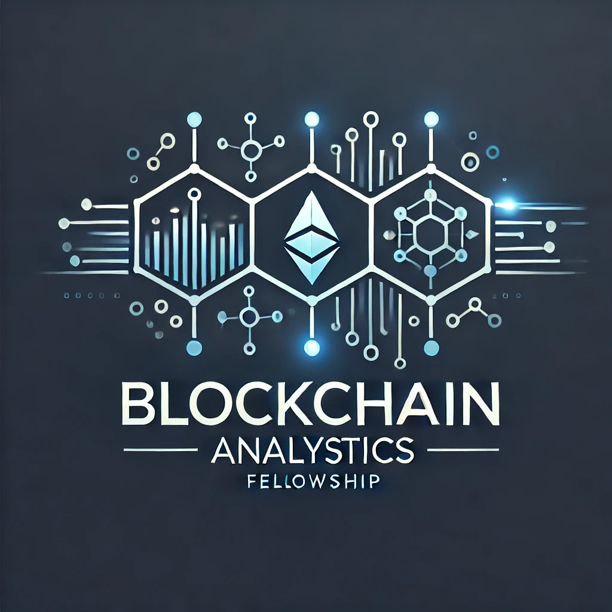

<h1 align="center"><strong>Blockchain Analytics</strong></h1>

Welcome to the **Blockchain Analytics** project by DPIII for a potential UMass Lowell course. This tool aims to help users track and analyze fraudulent blockchain transactions, providing insights into cryptocurrency movements and forensics. This README outlines the project plan, including objectives, implementation strategies, development steps, and progress.

  <b>Dependencies:

  
  
  
  

### Project Objectives

- Create a comprehensive code base and roadmap for tracking blockchain transactions.
- Develop a potential future course on crypto analytics and forensics.
- Enable students to create a crypto tracking application and roadmap for the course.
- Identify and resolve potential issues for future students.

### Student Goals

- Learn about basic Blochain interactrions, Crypto Fraud, and ways of identifying and analysizing blokchain data to identify fraud wallets
- Develop a crypto tracking application project and roadmap for a potential future course.
- Identify and resolve issues to streamline the course for future students.

### Student Tasks

- Research and determine the feasibility of tracking Bitcoin and Etherium using a private code base and basic crypto APIs.
- Develop a code base that can track Bitcoin transactions.
- Create a roadmap outlining the necessary skills for students to complete the course.

### Specific Expectations

- Assess the feasibility of the course for students and level of rigor (Undergraduate or Masters evel).
- Develop a code base for **tracking Bitcoin and Etherium** transactions.
- Create a roadmap detailing the skills required for the course.

# Roadmap

## Phase 1: Environment Setup ✓
1. **Create Environment and `.gitignore` for Etherscan API Key**
   - Set up a virtual environment for the project.
   - Create a `.gitignore` file to exclude sensitive information such as the Etherscan API key.
   - Create custom `logger_config.py` for program store logs in `crypto_analyis.log`

## Phase 2: Basic Functionality ✓
2. **Create `main.py` and Import Necessary Modules**
   - Initialize the main script file (`main.py`).
   - Import essential modules such as `requests`, `sqlite3`, `pandas`, and custom modules.
   - Create `api_module.py` for API use functionality
3. **Create Basic API Call for Single Wallet Balance**
   - Develop a function to fetch the balance of a single wallet address using the Etherscan API.
   - Integrate this function into `main.py` and test it.

4. **Create Multi-Address Balance Retrieval Feature**
   - Develop a function to fetch balances for multiple wallet addresses.
   - Integrate this function into `main.py` and test it.

## Phase 3: Transaction Tracking ✓
5. **Create Function to Fetch 'Normal' Transactions**
   - Develop a function to fetch a list of 'Normal' transactions for given addresses.
   - Integrate this function into `main.py` and test it.

## Phase 4: Data Storage and Organization 
6. **Store and Organize Transaction Data** ✓
   - Design a `database.py` (SQLite3) to store long term large data transaction details for each address into `etherscan_data.db`.
   - Pull long term big data from database and convert to Pandas Dataframe for faster analysis.

7. **Sort and Organize Transaction Data** 
   - Create `analysis.py` and develop an algorithm to sort and identify fraudulently connected addresses in the pandas dataframe transactions.
   - Run all the response wallet transaction data through this algorithm and indentify the string transactions and addresses connected to the root fraudulant address.

## Phase 5: Data Visualization
8. **Visualize Transactions**
   - Use a data visualization tool like NetworkX to visualize the transactions.
   - Create visual representations of the transaction data to identify patterns and insights.

## Phase 6: Documentation and Course Development
9. **Create Documentation**
   - Document the code base and provide clear instructions for setting up and running the project.
   - Create a detailed README file outlining the project objectives, setup instructions, and usage.

10. **Develop Course Roadmap**
   - Create a roadmap detailing the skills required for the course.
   - Outline the course structure, including modules, lessons, cumilative projects, and assignments.

# WORKFLOW 

1. Create ENV and `.gitignore` for Etherscan API key.
2. Create `main.py` and import necessary modules.
3. Create a basic API call to get the balance of a single wallet address.
4. Create a multi-address balance retrieval feature and integrate it into `main.py`.
5. Create a function to fetch a list of 'Normal' transactions for addresses and call it in `main.py`.
6. Create `database.py` & `etherscan_data.db` to store and organize transaction data using a data structure (long term big data SQLite database).
7. Develop an algorithm to sort and organize repeated sends and addresses in `analysis.py`.
8. Visualize the transactions using a data visualization tool like NetworkX or Matplotlib .

